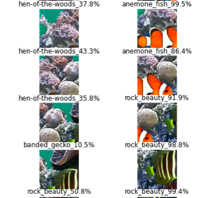

# Find Nemo project

In this notebook I will detect image of Nemo, I will use a pretrained CNN to recognize objects in a photograph of aquarium.

Tasks from tutorial:
- Chop up the image into slices of 224x224 pixels,
- Predict labels using a pre-trained network (e.g. MobileNet),
- Collect labels / predictions for all slices,
- Filter out predictions that are below a certain probability threshold,
- Analyze and plot the results

